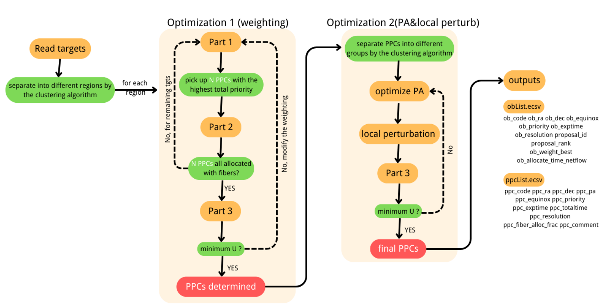

# PPP v2

This tool is designed to determine PFS pointing centers (PPCs) for the PFS open-use proposals. It determined PPCs to:

* maximize the average completion rate of proposals
* maximize the average fiber usage fraction 

## Basic scheme

* Part 1: determine PPCs by KDE peaks
	* basic flow
      * assign weight to each target --> calculate the weighted KDE --> put one PPC at the KDE peak --> randomly assume (2394-200) targets in the PPC are observed --> repeat until all targets are "observed"
  
  * the weighting scheme W = W1 * W2 * W3
    
    |  weight | meaning | format | free parameter | 
    |---|---|---|---|
    | w1 | science priority | pow(a, sci_pri) | a |
    | w2 | exposure time | pow(exptime_remained, b) | b |
    | w3 | count of surrounding targets | pow(local_count, c) | c |
    	
    * generally, targets with <strong>higher rank</strong> would be given higher weight
    * rank is combined with inner priority (P0-9 given by users) by separating the semi-interval of the two nearby ranks into 10 bins, see the example below:
        * assume proposal A: rank = 8.5, proposal B: rank = 6.5, proposal C: rank = 2.5            
        * <strong>P0-9</strong> targets in proposal A has the final "sci_pri" of 8.5, 8.4, 8.3, ..., 7.6; 
        * <strong>P0-9</strong> targets in proposal B has the final "sci_pri" of 6.5, 6.3, 6.1, 5.9, ..., 4.7;
        * <strong>P0-9</strong> targets in proposal C has the final "sci_pri" of 2.5, 2.375, 2.25 , 2.125, ..., 1.375

* Part 2: run netflow
  * basic flow
    * read targets and PPCs --> set "nonObservationCost" with the weight of each target --> run netflow (if there is no fiber allocation in any PPCs: do a local perturbation with 0.15 deg of those PPCs --> run netflow again until all PPCs have fiber allocation)
  * setup:
    * "nonObservationCost" = weight
    * "partialObservationCost" = weight * 1.5
    * no calibrators or fillers included
    * the module to check trajectory collision of cobra is turned off as default to save time
    * "collision_distance" = 2 
    * "mipgap" = 1% (tolerance of Gurobi)

* Part 3: calculate the function to be minimized
  * basic flow
    * read target list and list of fiber allocation of PPCs --> calculate the completion rate (CR) and fiber allocation efficiency (fibAlloEffi) --> calcualte the function to be minimized U
  * setup
    * U = f_L * (( 1 - CR_L )+( 1 - fibAlloEffi_L )) + f_M * (( 1 - CR_M )+( 1 - fibAlloEffi_M ))
        * set f_L = f_M = 1 as default, but can be modified if different weights would be given between the two modes
    * CR has the following methods to calculate
        * method 1: CR = $\left(\sum\limits_{i}^{tgt,done} w_{i} + 0.5\times\sum\limits_{i}^{tgt,partial} w_{i} \right)/\sum\limits_{i}^{tgt} w_{i}$, $w$ is the weight of each target
        * method 2 (default): CR = $\frac{1}{n_{proposal}}\sum\limits_{i}^{proposal} N_{i,done}/N_{i,tot}$
    * fibAlloEffi = $\frac{1}{n_{PPC}}\sum\limits_{i}^{PPC} N_{i,used-scifiber}/N_{i,total-scifiber}$, $N_{total-scifiber}$ = 2394 temporarily 

* Overall flow of PPP


## Getting Started

### Prerequisites

* Python 3
* The following packages are required:
```
pip install astropy seaborn colorcet psutil scikit-learn 
```
* netflow 
    * refer to [here](https://github.com/Subaru-PFS/ets_fiberalloc)

### Executing program

* read target list
    * method 1 - from local folder, e.g.,
      ```
      readsamp_con={'mode':'local', 'localPath':'PATH_to_file/YourFile.csv'}
      ```
    * method 2 - from database, e.g.,
      ```
      readsamp_con={'mode':'db', 'dialect':'postgresql','user':'obsproc','pwd':'obsproc','host':'pfsa-db01',\
              'port':'5433','dbname':'targetdb_e2e_test','sql_query':sql_t}
      ```
      ('sql_query' is the SQL query to the DB, see example below)
      ```
      sql_t='''
      SELECT 
        T.ob_code, T.ra, T.dec, T.epoch, T.priority, T.effective_exptime, CASE WHEN T.is_medium_resolution = False THEN 'L' ELSE 'M' END AS resolution,      T.proposal_id, P.rank, P.grade
      FROM target as T
      JOIN proposal as P on T.proposal_id = P.proposal_id; 
      '''
      ```
      
* set the total on-source time
    * the time should be given in unit of seconds
    * the time of the low- and medium-resolution modes should be given separately
    * the input time should be comparable to the total required time of the input samples, e.g., if there are 10 input programs requiring 200 pointings to complete, the input time is recommended to be longer than ~150*900 sec to ensure plausible outputs.
 

